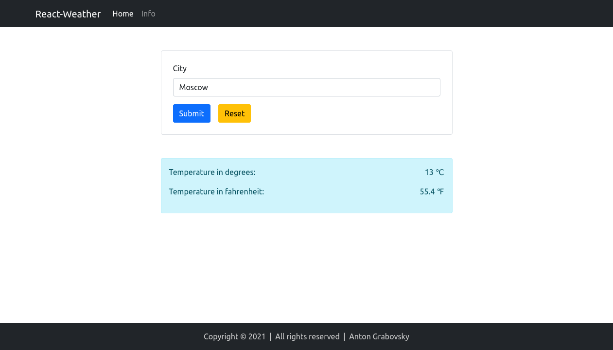

# React-Weather

[](https://github.com/sk1t0n/react-weather/actions/workflows/main.yml)

Web app to view the weather developed on React.js (React Hooks, React Router, React Testing Library, React Bootstrap).

The web application is available at this link <https://react-weather-grabovsky.herokuapp.com/>



## Install the dependencies

```sh
yarn
```

## Project setup

1. Register on the website <https://www.weatherapi.com>
2. Set the ***REACT_APP_WEATHER_KEY*** environment variable with the value received after registration

## Run web application

```sh
yarn start
```
